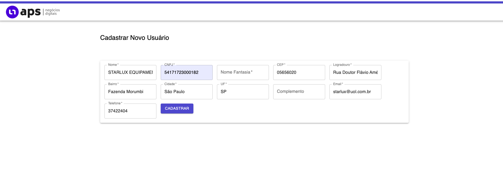
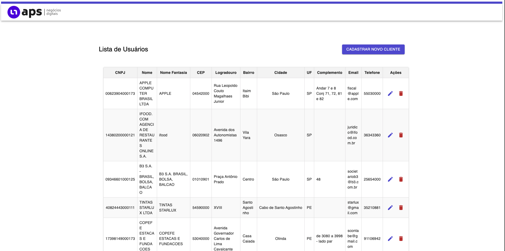
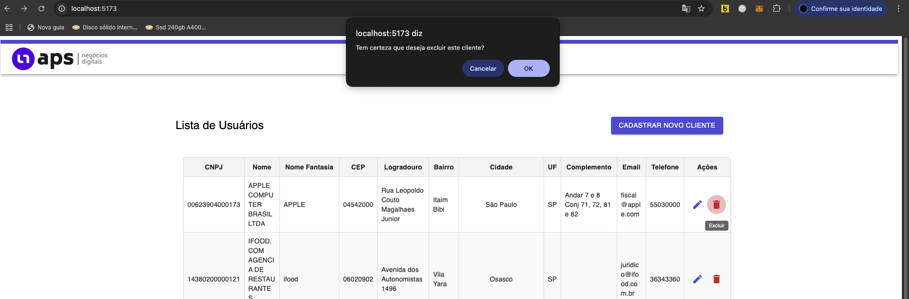

#  APS Crud - Projeto Fullstack

Este é um projeto fullstack. A aplicação permite o gerenciamento completo de clientes, com validações automáticas de **CNPJ** e preenchimento de **endereços via CEP**, utilizando tecnologias React no frontend e  Node.js backend.

---
## Organização do Projeto

O gerenciamento das tarefas, acompanhamento de progresso e divisão de responsabilidades foram realizados utilizando o [Jira]([https://www.atlassian.com/br/software/jira](https://luivaz2013.atlassian.net/jira/software/projects/MBA/boards/1?assignee=unassigned%2C712020%3A47e360cf-5c7e-4190-8512-57821f3a95f2)), garantindo organização, ao longo do desenvolvimento do projeto.
---

##  Tecnologias Utilizadas

###  Frontend
- React
- Material UI
- Axios
- Vite
- Integração com APIs públicas:
  - [CNPJ.ws](https://www.cnpj.ws/) – Dados da empresa via CNPJ
  - [ViaCEP](https://viacep.com.br/) – Preenchimento automático de endereço

###  Backend
- Node.js
- Express
- MySQL
- mysql2
- dotenv
- cors
- nodemon (dev)

---

##  Funcionalidades

- Cadastro de clientes
- Listagem de clientes
- Edição de dados
- Exclusão de clientes
- Validação de CNPJ com dígito verificador
- Preenchimento automático de informações da empresa via CNPJ
- Preenchimento automático de endereço via CEP

---

##  Como Executar o Projeto Localmente

###  Pré-requisitos

- Node.js 18 ou superior
- MySQL instalado e rodando localmente
- npm ou yarn

---

###  1. Configuração do Backend

```bash
cd backend
npm install

Crie um arquivo .env na raiz da pasta backend/ com o seguinte conteúdo:

DB_HOST=localhost
DB_USER=root
DB_PASSWORD=sua_senha
DB_DATABASE=nome_do_banco
PORT=3000

Inicie o servidor:

cd src/
node index.js


O backend estará disponível em: http://localhost:3000

⸻

 2. Configuração do Frontend

cd frontend
npm install
npm run dev

O frontend será executado em: http://localhost:5173

⸻

  Endpoints Locais
	•	Frontend: http://localhost:5173
	•	Backend: http://localhost:3000

⸻

📁 Estrutura do Projeto

Aps-Crud/
├── backend/
│   ├── src/
│   │   ├── controllers/
│   │   ├── models/
│   │   ├── routes/
│   │   ├── db.js
│   │   └── index.js
│   └── .env
├── frontend/
│   ├── src/
│   │   ├── Pages/
│   │   ├── components/
│   │   ├── services/
│   │   ├── main.jsx
│   │   └── App.jsx
│   └── .env

````

⸻

 Regras de Negócio
	•	CNPJ:
	•	Validação do dígito verificador ao digitar
	•	Preenchimento automático de informações da empresa via CNPJ.ws
	•	CEP:
	•	Preenchimento automático de logradouro, bairro, cidade e estado via ViaCEP

⸻

##  Exemplos da Interface

###  Tela de Cadastro


---

###  Tela de Listagem de Clientes


---

###  Tela de Exclusão de Cliente



 Licença

As APIs públicas utilizadas seguem suas respectivas políticas de uso. Para uso comercial ou em produção, consulte os termos de serviço das APIs.

⸻

Autor

Lui Manso
github.com/luivazmanso7
